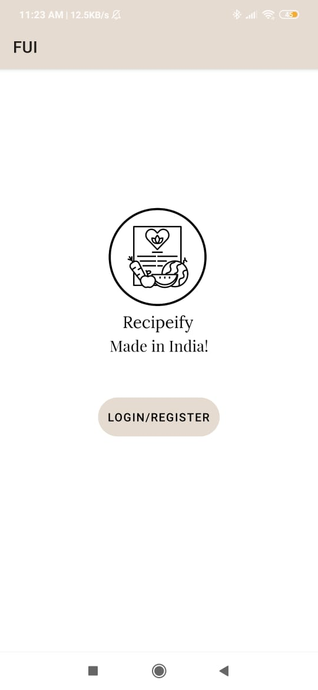
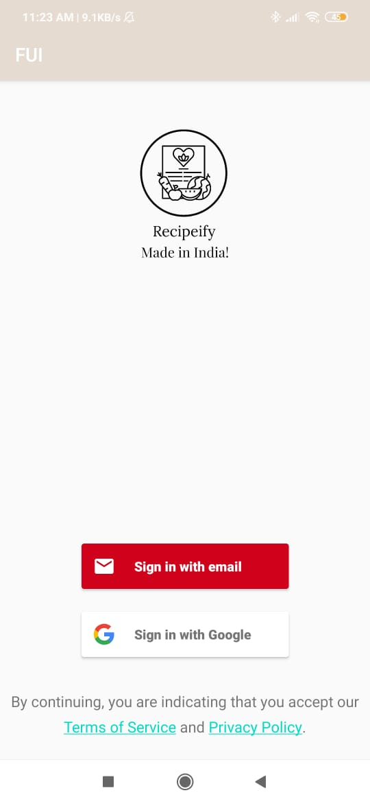
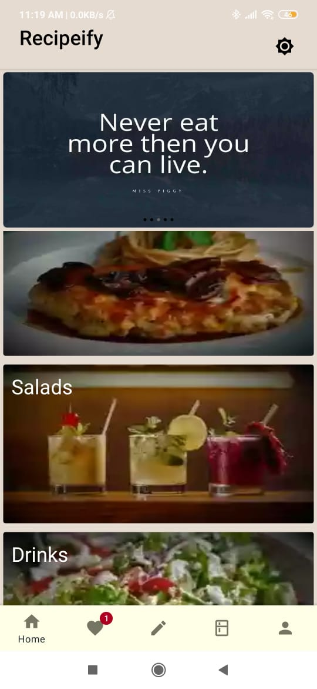
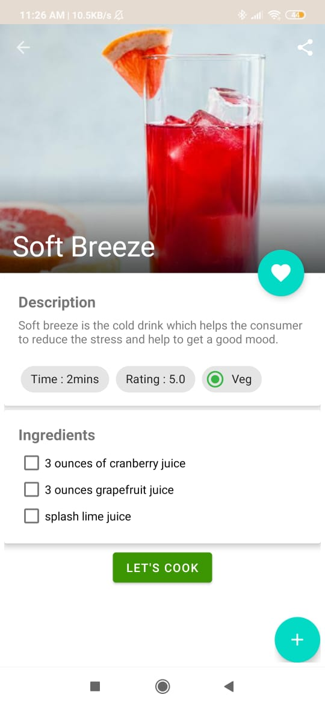
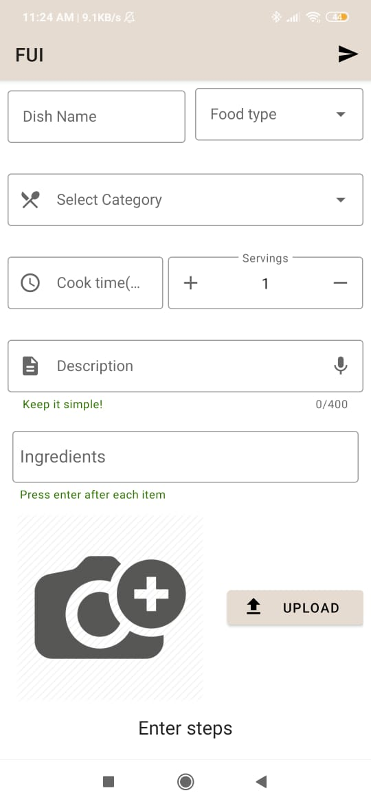

# Recipeify-Final-Year-Project
Recipeify - A Food recipe app

# Final Year Project 2021
Recipeify is a food application and a common platform for people to share their own recipes and also view, rate, share recipes which they find interesting.
A payment gateway is implemented in this app for future use to generate revenue through it and benefit people.
We have used Firebase Firestore as backend service and many more features.

# Demo:
https://www.youtube.com/watch?v=_Jmz901YTtw

# App screenshots:

